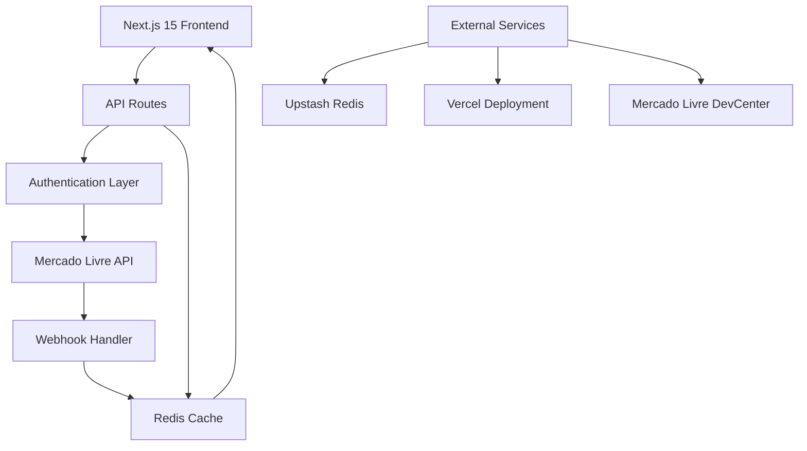

# Peepers - Mercado Livre Integration Platform

[](https://github.com/antoniovbraz/peepers)
[](LICENSE)
[](package.json)
[](https://nextjs.org/)

> **A professional e-commerce integration platform connecting seamlessly with Mercado Livre's marketplace APIs, featuring OAuth 2.0 + PKCE authentication, real-time webhook processing, and intelligent caching strategies.**

## 🚀 Quick Start

```bash
# Clone the repository
git clone https://github.com/antoniovbraz/peepers.git
cd peepers

# Install dependencies
npm install

# Set up environment variables
cp .env.example .env.local
# Edit .env.local with your Mercado Livre credentials

# Start development server with mocks (recommended)
npm run dev:mock

# Or start with real ML integration (requires HTTPS tunnel)
npm run dev
npm run tunnel  # In separate terminal
```

**🌐 Live Demo:** [https://peepers.vercel.app](https://peepers.vercel.app)

## ⚡ Key Features

| Feature | Description | Status |
|---------|-------------|--------|
| 🔐 **OAuth 2.0 + PKCE** | Secure authentication with CSRF protection | ✅ Production Ready |
| 🛒 **Product Management** | Full CRUD operations with Mercado Livre API | ✅ Production Ready |
| 🔄 **Real-time Webhooks** | Instant sync for orders, items, messages | ✅ Production Ready |
| ⚡ **Redis Caching** | Intelligent caching with auto-refresh | ✅ Production Ready |
| 📱 **Responsive Design** | Modern UI with Tailwind CSS v4 | ✅ Production Ready |
| 🧪 **Testing Suite** | Comprehensive testing with Vitest | ✅ Production Ready |

## 🏗️ Architecture Overview



### Tech Stack

- **Frontend**: Next.js 15, React 19, TypeScript 5
- **Styling**: Tailwind CSS v4, Lucide React Icons
- **Backend**: Next.js API Routes, Zod Validation
- **Database**: Redis (Upstash) for caching
- **Authentication**: OAuth 2.0 + PKCE
- **Testing**: Vitest, Coverage Reports
- **Deployment**: Vercel Platform

## 📚 Documentation

| Document | Description |
|----------|-------------|
| [🏗️ Architecture Guide](docs/ARCHITECTURE.md) | System design and patterns |
| [🔧 Developer Setup](docs/DEVELOPER_GUIDE.md) | Complete development guide |
| [📡 API Documentation](docs/API.md) | Endpoint reference |
| [🚀 Deployment Guide](docs/DEPLOYMENT.md) | Production deployment |
| [🤝 Contributing](docs/CONTRIBUTING.md) | Contribution guidelines |

## 🛠️ Development

### Prerequisites

- Node.js 18+ and npm
- Redis instance (or Upstash account)
- Mercado Livre Developer Account

### Environment Setup

1. **Clone and install**:

   ```bash
   git clone https://github.com/antoniovbraz/peepers.git
   cd peepers
   npm install
   ```

2. **Environment configuration**:

   ```bash
   cp .env.example .env.local
   ```

3. **Required environment variables**:

   ```env
   # Mercado Livre API
   ML_CLIENT_ID=your_client_id
   ML_CLIENT_SECRET=your_client_secret
   
   # Redis Cache
   UPSTASH_REDIS_REST_URL=your_redis_url
   UPSTASH_REDIS_REST_TOKEN=your_redis_token
   
   # Application
   NEXT_PUBLIC_APP_URL=https://your-domain.com
   ALLOWED_USER_IDS=user1,user2,user3
   ```

### Development Modes

```bash
# Recommended: Mock development (no ML integration)
npm run dev:mock

# Real integration (requires HTTPS tunnel)
npm run dev
npm run tunnel  # In separate terminal

# Production build
npm run build
npm start
```

### Testing & Quality

```bash
# Run test suite
npm run test

# Run with coverage
npm run test -- --coverage

# Lint code
npm run lint

# Production endpoint testing
npm run test:prod all
npm run test:prod health
npm run test:prod products-public
```

## 📡 API Reference

### Authentication Endpoints

| Method | Endpoint | Description |
|--------|----------|-------------|
| `GET` | `/api/auth/mercado-livre` | Initiate OAuth flow |
| `GET` | `/api/auth/mercado-livre/callback` | OAuth callback handler |
| `GET` | `/api/auth/me` | Get current user status |

### Product Endpoints

| Method | Endpoint | Auth Required | Description |
|--------|----------|---------------|-------------|
| `GET` | `/api/products-public` | ❌ | Public product listing |
| `GET` | `/api/products` | ✅ | Authenticated product access |
| `POST` | `/api/sync` | ✅ | Force product synchronization |

### System Endpoints

| Method | Endpoint | Description |
|--------|----------|-------------|
| `GET` | `/api/health` | Health check |
| `GET` | `/api/cache-debug` | Cache diagnostics |
| `POST` | `/api/webhook/mercado-livre` | ML webhook handler |

### Rate Limits

- **1,000 calls/hour** per application
- **5,000 calls/day** per user
- **Automatic retry** with exponential backoff

## 🚀 Deployment

### Vercel (Recommended)

1. **Connect repository**:

   ```bash
   vercel --prod
   ```

2. **Environment variables**: Configure in Vercel dashboard

3. **Domain setup**: 
   - Add custom domain in Vercel
   - Update `NEXT_PUBLIC_APP_URL`
   - Configure DNS records

### Manual Deployment

1. **Build application**:

   ```bash
   npm run build
   ```

2. **Start production server**:

   ```bash
   npm start
   ```

## 🔐 Security & Compliance

### HTTPS Requirements

**⚠️ CRITICAL**: Mercado Livre requires HTTPS for ALL operations:

- ✅ OAuth redirect URIs must use HTTPS
- ✅ Webhook endpoints must use HTTPS  
- ✅ All API calls must use HTTPS
- ❌ HTTP is not supported in production

### Authentication Security

- **OAuth 2.0 + PKCE** implementation
- **CSRF protection** with state validation
- **Token auto-refresh** mechanism
- **User authorization** via `ALLOWED_USER_IDS`

### Data Protection

- **No sensitive data** in client-side code
- **Redis encryption** in transit and at rest
- **Environment variable** security
- **Rate limiting** and abuse prevention

## 🛠️ Troubleshooting

### Common Issues

**Error: "redirect_uri mismatch"**

- ✅ Verify URL in Mercado Livre matches exactly
- ✅ Ensure HTTPS is used
- ✅ Check for trailing slashes

**Error: "invalid_operator_user_id"**

- ✅ Use administrator account (not operator)
- ✅ Verify account permissions

**Error: "PKCE verification failed"**

- ✅ Ensure PKCE is enabled in application
- ✅ Check code_verifier generation

**Webhook not receiving data**

- ✅ URL must be HTTPS
- ✅ Respond with HTTP 200 within 5 seconds
- ✅ Validate topic and resource_id

## 📊 Performance & Monitoring

### Caching Strategy

- **Product cache**: 2 hours TTL
- **User data**: 30 minutes TTL  
- **Categories**: 24 hours TTL
- **Auto-refresh** on expiration

### Monitoring

- ✅ Health check endpoint active
- ✅ Cache performance metrics
- ✅ API rate limit tracking
- ✅ Error logging with Pino

## 🤝 Contributing

We welcome contributions! Please see our [Contributing Guidelines](docs/CONTRIBUTING.md) for details.

### Development Workflow

1. Fork the repository
2. Create feature branch (`git checkout -b feature/amazing-feature`)
3. Make changes and add tests
4. Run test suite (`npm run test`)
5. Commit changes (`git commit -m 'Add amazing feature'`)
6. Push to branch (`git push origin feature/amazing-feature`)
7. Open a Pull Request

### Code Standards

- **TypeScript** for type safety
- **ESLint** for code quality
- **Prettier** for formatting
- **Conventional Commits** for commit messages

## 📄 License

This project is licensed under the MIT License - see the [LICENSE](LICENSE) file for details.

## 🙋‍♂️ Support

- **Documentation**: [docs/](docs/)
- **Issues**: [GitHub Issues](https://github.com/antoniovbraz/peepers/issues)
- **Discussions**: [GitHub Discussions](https://github.com/antoniovbraz/peepers/discussions)

---

<div align="center">
  <p>Built with ❤️ by <a href="https://github.com/antoniovbraz">Antonio Braz</a></p>
  <p>
    <a href="https://peepers.vercel.app">Live Demo</a> •
    <a href="docs/">Documentation</a> •
    <a href="https://github.com/antoniovbraz/peepers/issues">Report Bug</a>
  </p>
</div>