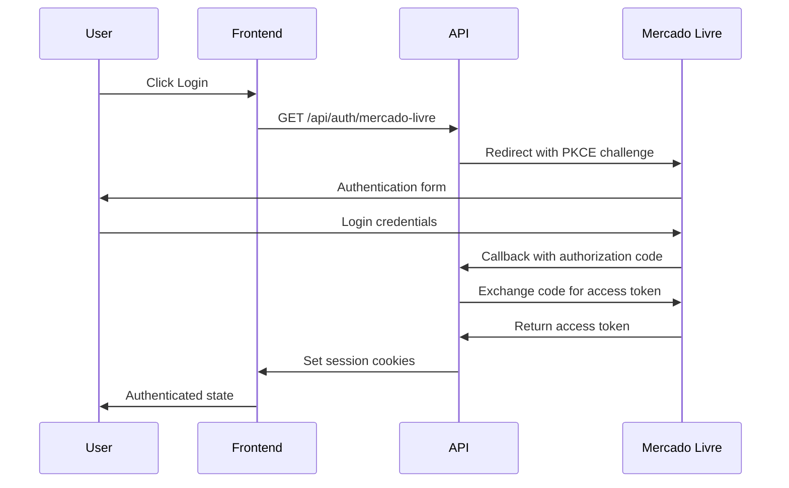

# API Documentation

## Overview

The Peepers API provides a comprehensive interface for managing Mercado Livre product integration, OAuth authentication, and real-time webhook processing. All endpoints follow RESTful conventions with consistent response formats.

## Base URL

- **Production**: `https://peepers.vercel.app`
- **Development**: `http://localhost:3000`

## Authentication

### OAuth 2.0 + PKCE Flow

Peepers implements OAuth 2.0 with PKCE (Proof Key for Code Exchange) for secure authentication with Mercado Livre.

#### Flow Overview



## Endpoints

### Authentication Endpoints

#### Initiate OAuth Flow

```http
GET /api/auth/mercado-livre
```

Initiates the OAuth 2.0 + PKCE authentication flow with Mercado Livre.

**Parameters**: None

**Response**: Redirects to Mercado Livre authorization URL

**Example**:
```bash
curl -X GET https://peepers.vercel.app/api/auth/mercado-livre
```

---

#### OAuth Callback

```http
GET /api/auth/mercado-livre/callback?code={code}&state={state}
```

Handles the OAuth callback from Mercado Livre and completes the authentication flow.

**Query Parameters**:
- `code` (string, required): Authorization code from ML
- `state` (string, required): CSRF protection state parameter

**Response**: Redirects to admin dashboard or login page

**Success Response**:
```http
HTTP/1.1 302 Found
Location: /admin
Set-Cookie: session_token=...; HttpOnly; Secure
Set-Cookie: user_id=...; HttpOnly; Secure
```

**Error Response**:
```json
{
  "success": false,
  "error": "Invalid authorization code",
  "timestamp": "2025-09-15T10:30:00.000Z"
}
```

---

#### Get Authentication Status

```http
GET /api/auth/me
```

Returns the current user's authentication status and profile information.

**Authentication**: Required (session cookies)

**Response**:
```json
{
  "success": true,
  "data": {
    "user": {
      "id": 123456789,
      "nickname": "user_nickname",
      "first_name": "João",
      "last_name": "Silva",
      "email": "joao@email.com",
      "country_id": "BR",
      "site_id": "MLB"
    },
    "authenticated": true,
    "token_expires_at": "2025-03-15T10:30:00.000Z"
  },
  "timestamp": "2025-09-15T10:30:00.000Z"
}
```

**Error Response** (Unauthenticated):
```json
{
  "success": false,
  "error": "Authentication required",
  "timestamp": "2025-09-15T10:30:00.000Z"
}
```

---

### Product Endpoints

#### Get Public Products

```http
GET /api/products-public
```

Returns a public list of products without requiring authentication. Used for homepage display.

**Authentication**: Not required

**Query Parameters**:
- `limit` (number, optional): Maximum number of products (default: 50)
- `category` (string, optional): Filter by category ID

**Response**:
```json
{
  "success": true,
  "data": {
    "products": [
      {
        "id": "MLB123456789",
        "title": "iPhone 15 Pro Max 256GB",
        "price": 7999.99,
        "currency_id": "BRL",
        "thumbnail": "https://http2.mlstatic.com/...",
        "permalink": "https://produto.mercadolivre.com.br/...",
        "condition": "new",
        "listing_type_id": "gold_special",
        "category": {
          "id": "MLB1055",
          "name": "Celulares e Smartphones"
        },
        "location": {
          "city": "São Paulo",
          "state": "SP"
        }
      }
    ],
    "total": 150,
    "cached_at": "2025-09-15T08:00:00.000Z",
    "expires_at": "2025-09-15T10:00:00.000Z"
  },
  "timestamp": "2025-09-15T10:30:00.000Z"
}
```

**Error Response**:
```json
{
  "success": false,
  "error": "Failed to fetch products",
  "timestamp": "2025-09-15T10:30:00.000Z"
}
```

---

#### Get Authenticated Products

```http
GET /api/products
```

Returns the authenticated user's complete product catalog with full details.

**Authentication**: Required (session cookies)

**Query Parameters**:
- `status` (string, optional): Filter by status (`active`, `paused`, `closed`)
- `limit` (number, optional): Maximum number of products (default: 50)
- `offset` (number, optional): Pagination offset (default: 0)

**Response**:
```json
{
  "success": true,
  "data": {
    "products": [
      {
        "id": "MLB123456789",
        "title": "iPhone 15 Pro Max 256GB",
        "price": 7999.99,
        "available_quantity": 5,
        "sold_quantity": 25,
        "status": "active",
        "condition": "new",
        "pictures": [
          {
            "id": "pic123",
            "url": "https://http2.mlstatic.com/...",
            "secure_url": "https://http2.mlstatic.com/...",
            "size": "1200x1200"
          }
        ],
        "attributes": [
          {
            "id": "BRAND",
            "name": "Marca",
            "value_name": "Apple"
          },
          {
            "id": "MODEL",
            "name": "Modelo",
            "value_name": "iPhone 15 Pro Max"
          }
        ],
        "shipping": {
          "free_shipping": true,
          "mode": "me2",
          "dimensions": "25x15x5,500"
        },
        "created_date": "2025-01-15T10:30:00.000Z",
        "last_updated": "2025-09-10T15:45:00.000Z"
      }
    ],
    "pagination": {
      "total": 150,
      "limit": 50,
      "offset": 0,
      "has_next": true
    }
  },
  "timestamp": "2025-09-15T10:30:00.000Z"
}
```

---

#### Force Product Synchronization

```http
POST /api/sync
```

Triggers immediate synchronization of products from Mercado Livre, bypassing cache.

**Authentication**: Required (session cookies)

**Request Body**: None

**Response**:
```json
{
  "success": true,
  "data": {
    "sync_id": "sync_abc123",
    "products_synced": 150,
    "products_updated": 12,
    "products_created": 3,
    "sync_duration_ms": 2450,
    "cached_until": "2025-09-15T12:30:00.000Z"
  },
  "timestamp": "2025-09-15T10:30:00.000Z"
}
```

**Error Response**:
```json
{
  "success": false,
  "error": "Sync already in progress",
  "timestamp": "2025-09-15T10:30:00.000Z"
}
```

---

### System Endpoints

#### Health Check

```http
GET /api/health
```

Returns the current system health status and dependency checks.

**Authentication**: Not required

**Response**:
```json
{
  "status": "healthy",
  "timestamp": "2025-09-15T10:30:00.000Z",
  "version": "0.1.1",
  "environment": "production",
  "checks": {
    "redis": {
      "status": "connected",
      "latency_ms": 15,
      "memory_usage": "45.2MB"
    },
    "mercado_livre_api": {
      "status": "reachable",
      "response_time_ms": 120
    },
    "cache": {
      "hit_rate": 0.85,
      "keys_count": 1250
    }
  },
  "uptime_seconds": 86400
}
```

**Unhealthy Response**:
```json
{
  "status": "degraded",
  "timestamp": "2025-09-15T10:30:00.000Z",
  "checks": {
    "redis": {
      "status": "error",
      "error": "Connection timeout"
    },
    "mercado_livre_api": {
      "status": "reachable",
      "response_time_ms": 120
    }
  }
}
```

---

#### Cache Debug

```http
GET /api/cache-debug
```

Returns detailed cache information for debugging purposes.

**Authentication**: Not required (but should be disabled in production)

**Response**:
```json
{
  "success": true,
  "data": {
    "cache_status": "operational",
    "keys": {
      "products:all": {
        "exists": true,
        "ttl_seconds": 3600,
        "size_bytes": 1048576,
        "last_accessed": "2025-09-15T10:25:00.000Z"
      },
      "user:123456789:token": {
        "exists": true,
        "ttl_seconds": 1800,
        "size_bytes": 2048,
        "last_accessed": "2025-09-15T10:30:00.000Z"
      }
    },
    "statistics": {
      "total_keys": 1250,
      "memory_usage": "45.2MB",
      "hit_rate": 0.85,
      "operations_per_second": 150
    }
  },
  "timestamp": "2025-09-15T10:30:00.000Z"
}
```

---

### Webhook Endpoints

#### Mercado Livre Webhook

```http
POST /api/webhook/mercado-livre
```

Receives webhook notifications from Mercado Livre for real-time updates.

**Authentication**: Webhook signature validation (if available)

**Request Body**:
```json
{
  "resource": "/orders/123456789",
  "user_id": 123456789,
  "topic": "orders_v2",
  "application_id": 7654321,
  "attempts": 1,
  "sent": "2025-09-15T10:30:00.000Z",
  "received": "2025-09-15T10:30:05.000Z"
}
```

**Response**:
```json
{
  "success": true,
  "data": {
    "processed": true,
    "action": "cache_invalidated",
    "resource_type": "order"
  },
  "timestamp": "2025-09-15T10:30:05.000Z"
}
```

**Supported Topics**:
- `orders_v2`: Order status changes
- `items`: Product updates
- `messages`: Customer messages
- `shipments`: Shipping updates

---

## Rate Limiting

### Mercado Livre API Limits

- **1,000 calls/hour** per application
- **5,000 calls/day** per user
- **Automatic retry** with exponential backoff

### Peepers API Limits

- **100 requests/minute** per IP for public endpoints
- **1,000 requests/hour** per authenticated user
- **No limits** for health check endpoint

**Rate Limit Headers**:
```http
X-RateLimit-Limit: 100
X-RateLimit-Remaining: 95
X-RateLimit-Reset: 1694780400
```

**Rate Limit Exceeded Response**:
```json
{
  "success": false,
  "error": "Rate limit exceeded",
  "retry_after": 60,
  "timestamp": "2025-09-15T10:30:00.000Z"
}
```

## Error Codes

### HTTP Status Codes

| Code | Description | Usage |
|------|-------------|-------|
| 200 | OK | Successful request |
| 201 | Created | Resource created successfully |
| 400 | Bad Request | Invalid request parameters |
| 401 | Unauthorized | Authentication required |
| 403 | Forbidden | Access denied |
| 404 | Not Found | Resource not found |
| 429 | Too Many Requests | Rate limit exceeded |
| 500 | Internal Server Error | Server error |
| 502 | Bad Gateway | External service error |
| 503 | Service Unavailable | Service temporarily unavailable |

### Application Error Codes

| Code | Description | Resolution |
|------|-------------|------------|
| `INVALID_TOKEN` | OAuth token is invalid or expired | Re-authenticate |
| `PKCE_VERIFICATION_FAILED` | PKCE challenge verification failed | Restart OAuth flow |
| `RATE_LIMIT_EXCEEDED` | API rate limit exceeded | Wait and retry |
| `CACHE_CONNECTION_ERROR` | Redis connection failed | Check cache service |
| `ML_API_ERROR` | Mercado Livre API error | Check ML service status |
| `USER_NOT_AUTHORIZED` | User not in allowed list | Check ALLOWED_USER_IDS |

## SDKs and Examples

### JavaScript/TypeScript

```typescript
interface PeepersApiClient {
  baseUrl: string;
  
  async getPublicProducts(options?: {
    limit?: number;
    category?: string;
  }): Promise<APIResponse<ProductsResponse>>;
  
  async syncProducts(): Promise<APIResponse<SyncResponse>>;
  
  async getHealthStatus(): Promise<HealthResponse>;
}

// Usage example
const client = new PeepersApiClient('https://peepers.vercel.app');

const products = await client.getPublicProducts({ limit: 20 });
if (products.success) {
  console.log('Products:', products.data.products);
}
```

### cURL Examples

**Get public products**:
```bash
curl -X GET "https://peepers.vercel.app/api/products-public?limit=10" \
  -H "Accept: application/json"
```

**Authenticate and sync products**:
```bash
# First, get session cookie via OAuth flow
# Then use authenticated endpoints
curl -X POST "https://peepers.vercel.app/api/sync" \
  -H "Cookie: session_token=...; user_id=..." \
  -H "Accept: application/json"
```

**Health check**:
```bash
curl -X GET "https://peepers.vercel.app/api/health" \
  -H "Accept: application/json"
```

### Python Example

```python
import requests

class PeepersClient:
    def __init__(self, base_url="https://peepers.vercel.app"):
        self.base_url = base_url
        self.session = requests.Session()
    
    def get_public_products(self, limit=50):
        response = self.session.get(
            f"{self.base_url}/api/products-public",
            params={"limit": limit}
        )
        return response.json()
    
    def health_check(self):
        response = self.session.get(f"{self.base_url}/api/health")
        return response.json()

# Usage
client = PeepersClient()
health = client.health_check()
print(f"System status: {health['status']}")

products = client.get_public_products(limit=10)
if products['success']:
    print(f"Found {len(products['data']['products'])} products")
```

## Webhooks

### Setup Requirements

1. **HTTPS endpoint**: Must use HTTPS for security
2. **Fast response**: Must respond within 5 seconds
3. **HTTP 200**: Must return success status
4. **Idempotent**: Handle duplicate notifications

### Webhook Signature Validation

If Mercado Livre provides webhook signatures:

```typescript
import crypto from 'crypto';

function validateWebhookSignature(
  payload: string,
  signature: string,
  secret: string
): boolean {
  const expectedSignature = crypto
    .createHmac('sha256', secret)
    .update(payload)
    .digest('hex');
  
  return crypto.timingSafeEqual(
    Buffer.from(signature),
    Buffer.from(expectedSignature)
  );
}
```

### Webhook Processing Pattern

```typescript
export async function POST(request: Request) {
  const startTime = Date.now();
  
  try {
    const payload = await request.json();
    
    // Log notification
    logger.info({ payload }, 'Webhook received');
    
    // Validate if signature available
    // await validateWebhookSignature(request, payload);
    
    // Process based on topic
    await processWebhookNotification(payload);
    
    // Return success quickly
    return new Response('OK', { status: 200 });
  } catch (error) {
    logger.error({ error }, 'Webhook processing failed');
    
    // Still return 200 to avoid retries for client errors
    if (error instanceof ValidationError) {
      return new Response('Invalid payload', { status: 200 });
    }
    
    return new Response('Error', { status: 500 });
  } finally {
    const duration = Date.now() - startTime;
    logger.info({ duration }, 'Webhook processing completed');
  }
}
```

## Testing

### Production Testing

Use the built-in testing scripts:

```bash
# Test all endpoints
npm run test:prod all

# Test specific endpoints
npm run test:prod health
npm run test:prod products-public
npm run test:prod products
npm run test:prod auth-me
```

### Postman Collection

Import the Postman collection for interactive API testing:

```json
{
  "info": {
    "name": "Peepers API",
    "description": "Complete API collection for Peepers"
  },
  "variable": [
    {
      "key": "baseUrl",
      "value": "https://peepers.vercel.app"
    }
  ],
  "item": [
    {
      "name": "Get Public Products",
      "request": {
        "method": "GET",
        "url": "{{baseUrl}}/api/products-public"
      }
    }
  ]
}
```

This API documentation provides comprehensive coverage of all Peepers endpoints with examples, error handling, and integration patterns to help developers integrate effectively.