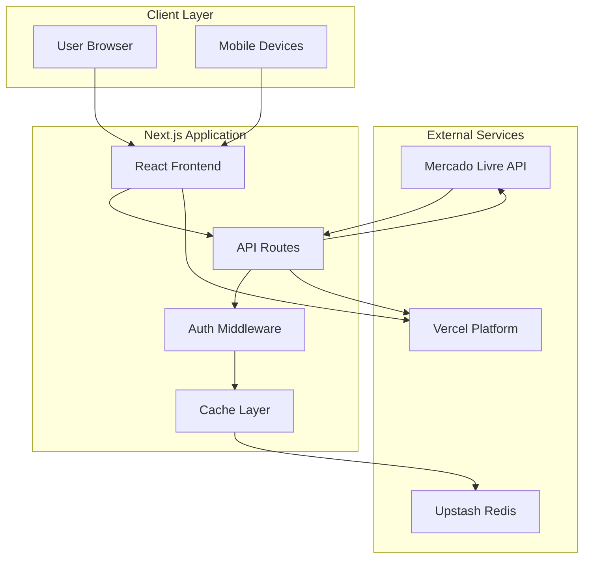
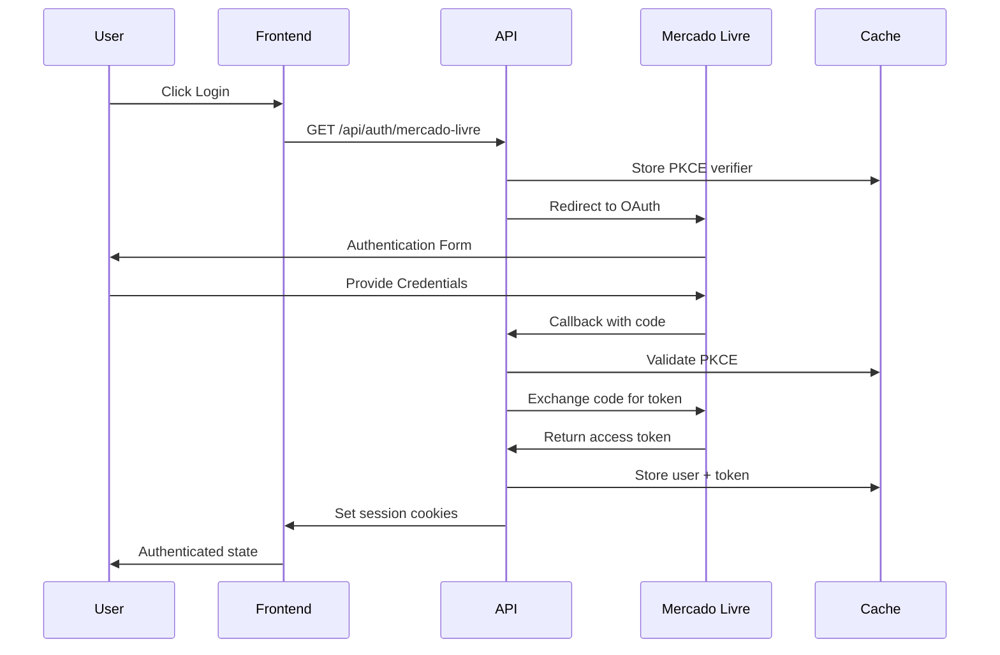
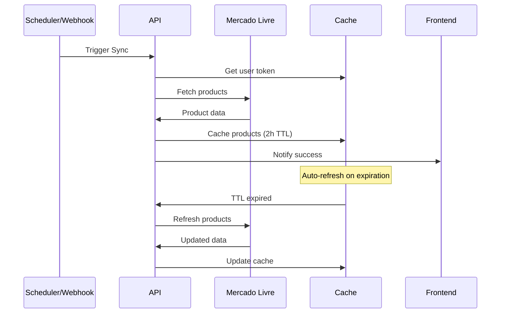
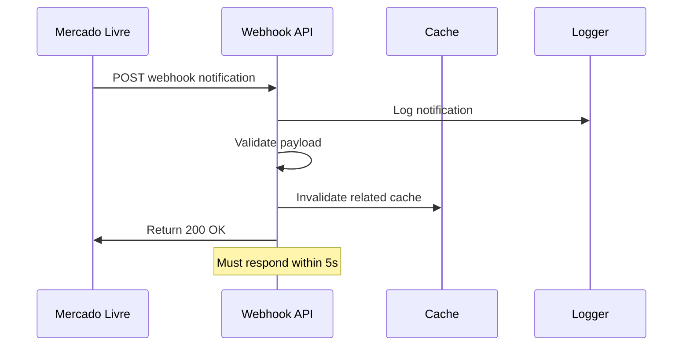

# Architecture Guide

## System Overview

Peepers is a modern Next.js 15 application designed for seamless integration with Mercado Livre's e-commerce ecosystem. The architecture emphasizes security, scalability, and developer experience while handling complex OAuth flows, real-time webhooks, and intelligent caching.

## Architecture Principles

### Design Philosophy

- **Security First**: OAuth 2.0 + PKCE, HTTPS enforcement, secure token management
- **Performance**: Redis caching with intelligent TTL strategies
- **Developer Experience**: Mock development mode, comprehensive testing, clear abstractions
- **Resilience**: Graceful error handling, automatic token refresh, fallback mechanisms
- **Scalability**: Stateless design, external cache, webhook processing

### Core Patterns

- **Centralized Configuration**: All routes, endpoints, and cache keys in `src/config/routes.ts`
- **Singleton Cache Client**: Single Redis connection with automatic reconnection
- **Middleware Protection**: Route-based authentication with user authorization
- **Type Safety**: Comprehensive TypeScript definitions for all ML API responses
- **Error Boundaries**: Graceful degradation and user-friendly error messages

## System Architecture



## Component Architecture

### Frontend Layer

#### Component Hierarchy

```
app/
├── layout.tsx                 # Root layout with providers
├── page.tsx                   # Homepage with product showcase
├── produtos/
│   ├── page.tsx              # Product listing page  
│   └── [id]/page.tsx         # Product detail page
├── admin/
│   ├── layout.tsx            # Protected admin layout
│   └── page.tsx              # Admin dashboard
└── login/
    └── page.tsx              # Authentication landing
```

#### UI Components

```
components/
├── ui/                       # Base UI components
│   ├── Button.tsx           # Themed button component
│   ├── Card.tsx             # Product card layouts
│   └── LoadingSpinner.tsx   # Loading states
├── layout/
│   ├── Header.tsx           # Navigation header
│   ├── Footer.tsx           # Site footer
│   └── Sidebar.tsx          # Admin sidebar
└── features/
    ├── ProductGrid.tsx      # Product display grid
    ├── AuthButton.tsx       # OAuth login button
    └── SyncStatus.tsx       # Sync progress indicator
```

### API Layer

#### Route Structure

```
api/
├── auth/
│   └── mercado-livre/
│       ├── route.ts         # OAuth initiation
│       └── callback/
│           └── route.ts     # OAuth callback handler
├── products/
│   └── route.ts             # Authenticated product access
├── products-public/
│   └── route.ts             # Public product endpoint
├── sync/
│   └── route.ts             # Force synchronization
├── webhook/
│   └── mercado-livre/
│       └── route.ts         # ML webhook handler
├── health/
│   └── route.ts             # Health check endpoint
└── cache-debug/
    └── route.ts             # Cache diagnostics
```

#### API Design Patterns

**Consistent Response Format**:
```typescript
interface APIResponse<T> {
  success: boolean;
  data?: T;
  error?: string;
  timestamp: string;
}
```

**Error Handling**:
```typescript
try {
  const result = await operation();
  return NextResponse.json({ 
    success: true, 
    data: result,
    timestamp: new Date().toISOString()
  });
} catch (error) {
  logger.error({ error }, 'Operation failed');
  return NextResponse.json({ 
    success: false, 
    error: error.message,
    timestamp: new Date().toISOString()
  }, { status: 500 });
}
```

## Data Flow Architecture

### Authentication Flow



### Product Sync Flow



### Webhook Processing



## Security Architecture

### OAuth 2.0 + PKCE Implementation

**PKCE Flow Components**:

1. **Code Challenge Generation**:
   ```typescript
   const codeVerifier = generateRandomString(128);
   const codeChallenge = base64url(sha256(codeVerifier));
   ```

2. **State Validation**:
   ```typescript
   const state = generateRandomString(32);
   await cache.setPKCE(state, codeVerifier, 600); // 10min TTL
   ```

3. **Token Exchange**:
   ```typescript
   const tokenResponse = await exchangeCodeForToken({
     code,
     codeVerifier,
     clientId,
     clientSecret
   });
   ```

### Middleware Security

**Route Protection**:
```typescript
export async function middleware(request: NextRequest) {
  // Skip public routes
  if (isPublicPath(request.nextUrl.pathname)) {
    return NextResponse.next();
  }
  
  // Validate session
  const sessionToken = request.cookies.get('session_token')?.value;
  const userId = request.cookies.get('user_id')?.value;
  
  if (!sessionToken || !userId) {
    return redirectToLogin(request);
  }
  
  // Check authorization
  const allowedUsers = process.env.ALLOWED_USER_IDS?.split(',') || [];
  if (allowedUsers.length > 0 && !allowedUsers.includes(userId)) {
    return redirectToAccessDenied(request);
  }
  
  // Validate token in cache
  const tokenData = await cache.getUser(userId);
  if (!tokenData || isTokenExpired(tokenData)) {
    return redirectToLogin(request);
  }
  
  return NextResponse.next();
}
```

### Data Protection

**Environment Variable Security**:
- Client secrets never exposed to frontend
- Redis credentials isolated to server
- User authorization list configurable

**HTTPS Enforcement**:
- All ML API calls require HTTPS
- OAuth redirects must use HTTPS
- Webhook endpoints must be HTTPS accessible

## Cache Architecture

### Redis Strategy

**Cache Client Singleton**:
```typescript
let kvClient: ReturnType<typeof createClient> | null = null;

export function getKVClient() {
  if (kvClient) return kvClient;
  
  kvClient = createClient({
    url: process.env.UPSTASH_REDIS_REST_URL,
    token: process.env.UPSTASH_REDIS_REST_TOKEN
  });
  
  return kvClient;
}
```

**TTL Strategy**:
```typescript
const CACHE_TTL = {
  PRODUCTS: 7200,    // 2 hours - product data
  USER_DATA: 1800,   // 30 minutes - user sessions
  CATEGORIES: 86400, // 24 hours - category data
  PKCE: 600         // 10 minutes - OAuth verifiers
} as const;
```

**Cache Key Patterns**:
```typescript
const CACHE_KEYS = {
  PRODUCTS_ALL: 'products:all',
  PRODUCT: (id: string) => `product:${id}`,
  USER_TOKEN: (userId: string) => `user:${userId}:token`,
  PKCE: (state: string) => `pkce:${state}`,
  CATEGORIES: 'categories:all'
} as const;
```

### Auto-Refresh Mechanism

```typescript
export async function getCachedProducts(): Promise<CachedProduct[]> {
  try {
    // Try cache first
    const cached = await kv.get<CachedProduct[]>(CACHE_KEYS.PRODUCTS_ALL);
    if (cached) return cached;
    
    // Cache miss - fetch from ML API
    const fresh = await fetchProductsFromML();
    
    // Cache with TTL
    await kv.setex(CACHE_KEYS.PRODUCTS_ALL, CACHE_TTL.PRODUCTS, fresh);
    
    return fresh;
  } catch (error) {
    logger.error({ error }, 'Failed to get cached products');
    
    // Fallback to stale cache
    const stale = await kv.get<CachedProduct[]>(`${CACHE_KEYS.PRODUCTS_ALL}:stale`);
    if (stale) return stale;
    
    throw error;
  }
}
```

## Integration Architecture

### Mercado Livre API Integration

**Client Configuration**:
```typescript
const ML_CONFIG = {
  BASE_URL: 'https://api.mercadolibre.com',
  OAUTH_URL: 'https://auth.mercadolivre.com.br/authorization',
  RATE_LIMITS: {
    CALLS_PER_HOUR: 1000,
    CALLS_PER_DAY: 5000
  },
  WEBHOOK_TOPICS: [
    'orders_v2',
    'items', 
    'messages',
    'shipments'
  ]
} as const;
```

**API Client Pattern**:
```typescript
export class MLApiClient {
  private baseURL = ML_CONFIG.BASE_URL;
  
  async makeRequest<T>(endpoint: string, token?: string): Promise<T> {
    const headers: Record<string, string> = {
      'Content-Type': 'application/json'
    };
    
    if (token) {
      headers.Authorization = `Bearer ${token}`;
    }
    
    const response = await fetch(`${this.baseURL}${endpoint}`, {
      headers,
      // Add retry logic and rate limiting
    });
    
    if (!response.ok) {
      throw new MLApiError(response.status, await response.text());
    }
    
    return response.json();
  }
}
```

### Webhook Architecture

**Webhook Handler Pattern**:
```typescript
export async function POST(request: Request) {
  try {
    const payload = await request.json();
    
    // Validate webhook signature (if ML provides one)
    await validateWebhookSignature(request, payload);
    
    // Log notification
    logger.info({ payload }, 'Webhook received');
    
    // Process based on topic
    switch (payload.topic) {
      case 'items':
        await handleItemUpdate(payload);
        break;
      case 'orders_v2':
        await handleOrderUpdate(payload);
        break;
      default:
        logger.warn({ topic: payload.topic }, 'Unknown webhook topic');
    }
    
    return new Response('OK', { status: 200 });
  } catch (error) {
    logger.error({ error }, 'Webhook processing failed');
    return new Response('Error', { status: 500 });
  }
}
```

## Performance Architecture

### Optimization Strategies

**Bundle Optimization**:
- Code splitting by route
- Dynamic imports for heavy components
- Tree shaking for unused code
- Image optimization with Next.js Image

**Runtime Performance**:
- React 19 concurrent features
- Streaming SSR for faster TTFB
- Client-side caching with SWR patterns
- Progressive loading for product grids

**Caching Layers**:
1. **Browser Cache**: Static assets, API responses
2. **CDN Cache**: Images, static content
3. **Redis Cache**: ML API responses, user sessions
4. **Application Cache**: In-memory caching for hot data

### Monitoring & Observability

**Logging Strategy**:
```typescript
import pino from 'pino';

export const logger = pino({
  level: process.env.LOG_LEVEL || 'info',
  transport: {
    target: 'pino-pretty',
    options: {
      colorize: true
    }
  }
});
```

**Health Checks**:
```typescript
export async function GET() {
  const health = {
    status: 'healthy',
    timestamp: new Date().toISOString(),
    checks: {
      redis: await checkRedisConnection(),
      mlApi: await checkMLApiConnection(),
      environment: process.env.NODE_ENV
    }
  };
  
  return NextResponse.json(health);
}
```

## Deployment Architecture

### Vercel Platform Integration

**Build Configuration**:
```typescript
// next.config.ts
const nextConfig: NextConfig = {
  serverExternalPackages: ['redis'],
  images: {
    remotePatterns: [
      {
        protocol: 'https',
        hostname: '*.mlstatic.com'
      }
    ]
  },
  async rewrites() {
    return [
      {
        source: '/produtos/:path*',
        destination: '/products/:path*'
      }
    ];
  }
};
```

**Environment Configuration**:
- Production: Vercel with environment variables
- Staging: Preview deployments for PRs
- Development: Local with mocks or HTTPS tunnel

### Scalability Considerations

**Horizontal Scaling**:
- Stateless application design
- External Redis for session storage
- CDN for static asset delivery
- API rate limiting and caching

**Vertical Scaling**:
- Efficient database queries
- Optimized bundle sizes
- Memory leak prevention
- Connection pooling

## Testing Architecture

### Testing Strategy

**Unit Tests**:
```typescript
// Cache functionality
describe('Cache Layer', () => {
  it('should cache products with correct TTL', async () => {
    const products = await getCachedProducts();
    expect(products).toBeDefined();
    // Verify TTL was set correctly
  });
});
```

**Integration Tests**:
```typescript
// API endpoint testing
describe('Products API', () => {
  it('should require authentication', async () => {
    const response = await fetch('/api/products');
    expect(response.status).toBe(401);
  });
});
```

**E2E Tests**:
```typescript
// OAuth flow testing
describe('Authentication Flow', () => {
  it('should complete OAuth flow successfully', async () => {
    // Test complete authentication workflow
  });
});
```

### Mock Strategy

**Development Mocks**:
```typescript
// Mock ML API responses for local development
export const mockProducts: MLProduct[] = [
  {
    id: 'MLB1234567890',
    title: 'Product Mock',
    price: 99.99,
    // ... full mock structure
  }
];
```

This architecture ensures Peepers remains maintainable, scalable, and secure while providing excellent developer experience and end-user performance.