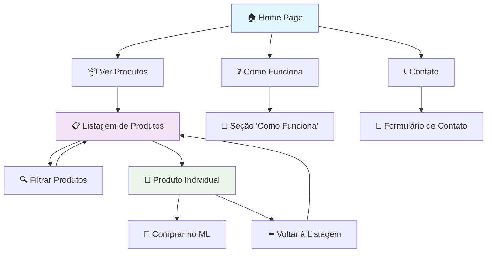
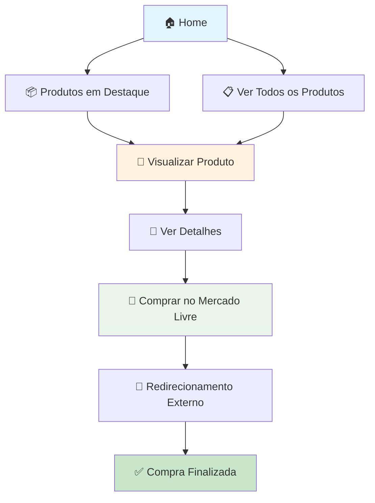
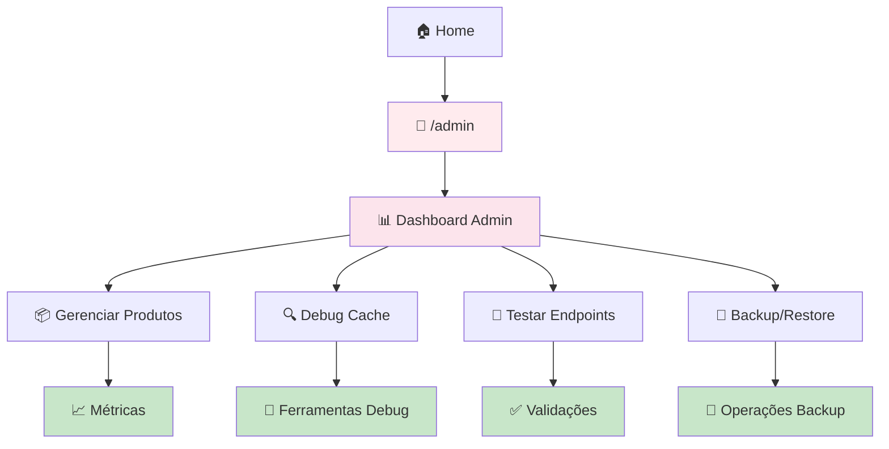

# Navigation Link Map

## 🗺️ Mapa de Navegação - Peepers

**Data:** 14 de Setembro de 2025
**Versão:** 0.1.1
**Status:** ⚠️ Parcialmente implementado

### 🎯 Metodologia
- **Análise:** Código fonte + estrutura de componentes
- **Ferramentas:** Next.js Link analysis + manual review
- **Cobertura:** Header, footer, navegação interna
- **Formato:** Mermaid flowcharts + documentação

---

## 📊 Resumo Executivo

| Componente | Status | Links | Problemas |
|------------|--------|-------|-----------|
| **Header** | ✅ Implementado | 4 links | 1 link quebrado |
| **Footer** | ✅ Implementado | 8 links | 6 links quebrados |
| **Navegação Interna** | ✅ Implementada | Dinâmicos | Nenhum |
| **Mobile Menu** | ❌ Não funcional | - | Menu não abre |
| **Breadcrumbs** | ❌ Não implementado | - | Ausente |

---

## 🧭 Arquitetura de Navegação

### Header Navigation
```
┌─────────────────────────────────────┐
│           HEADER NAV                │
├─────────────────────────────────────┤
│ 🏠 Home      📦 Produtos   ❓ Como   │
│           Funciona        📞 Contato │
└─────────────────────────────────────┘
          │         │           │
          ▼         ▼           ▼
       Home    Listagem    404 (não   ← Link quebrado
                      implementado)
```

### Footer Navigation
```
┌─────────────────────────────────────┐
│           FOOTER NAV                │
├─────────────────────────────────────┤
│ 📦 Produtos   🆕 Novos   🚚 Frete    │
│              Grátis                 │
│                                     │
│ 📖 Sobre      📞 Contato  📝 Blog    │
│                                     │
│ ❓ Ajuda      📋 Termos   🔒 Privacy │
└─────────────────────────────────────┘
          │         │           │
          ▼         ▼           ▼
       OK       404        404        ← Múltiplos links quebrados
```

---

## 🌊 Fluxos de Navegação (Mermaid)

### Fluxo Principal do Usuário



### Fluxo de Compra



### Fluxo Administrativo



---

## 🔗 Mapa Detalhado de Links

### Header Navigation

| Link | Destino | Status | Descrição |
|------|---------|--------|-----------|
| 🏠 **Home** | `/` | ✅ OK | Página inicial |
| 📦 **Produtos** | `/produtos` | ✅ OK | Listagem completa |
| ❓ **Como Funciona** | `#como-funciona` | ⚠️ Ancora | Seção na home page |
| 📞 **Contato** | `/contato` | ❌ 404 | Página não implementada |

### Footer Navigation - Produtos

| Link | Destino | Status | Descrição |
|------|---------|--------|-----------|
| 📦 **Todos os Produtos** | `/produtos` | ✅ OK | Listagem completa |
| 🆕 **Produtos Novos** | `/produtos?condition=new` | ✅ OK | Filtro aplicado |
| 🚚 **Frete Grátis** | `/produtos?shipping=free` | ✅ OK | Filtro aplicado |

### Footer Navigation - Empresa

| Link | Destino | Status | Descrição |
|------|---------|--------|-----------|
| 📖 **Sobre Nós** | `/sobre` | ❌ 404 | Página não existe |
| 📞 **Contato** | `/contato` | ❌ 404 | Página não existe |
| 📝 **Blog** | `/blog` | ❌ 404 | Página não existe |

### Footer Navigation - Suporte

| Link | Destino | Status | Descrição |
|------|---------|--------|-----------|
| ❓ **Central de Ajuda** | `/ajuda` | ❌ 404 | Página não existe |
| 📋 **Termos de Uso** | `/termos` | ❌ 404 | Página não existe |
| 🔒 **Privacidade** | `/privacidade` | ❌ 404 | Página não existe |

### Navegação Interna (Produtos)

| Origem | Link | Destino | Status |
|--------|------|---------|--------|
| Home | "Ver Produto" | `/produtos/{id}` | ✅ OK |
| Listagem | Card Produto | `/produtos/{id}` | ✅ OK |
| Produto | "Voltar" | `/produtos` | ✅ OK |
| Produto | "Comprar" | Mercado Livre | ✅ OK |

---

## 📱 Navegação Mobile

### Status Atual
- ❌ **Menu hamburger** não funcional
- ❌ **Nenhum JavaScript** para abrir/fechar menu
- ❌ **Menu oculto** permanentemente

### Problema Identificado
```html
<button className="md:hidden p-2 rounded-md...">
  <span className="sr-only">Abrir menu principal</span>
  <!-- Sem onClick handler -->
  <svg>...</svg>
</button>
```

### Solução Necessária
- Implementar estado para menu mobile
- Adicionar JavaScript para toggle
- Criar overlay/backdrop
- Garantir acessibilidade

---

## 🔍 Páginas Faltando (Gaps)

### Prioridade Alta
1. **`/contato`** - Formulário de contato
2. **`/sobre`** - Página institucional

### Prioridade Média
3. **`/blog`** - Artigos e conteúdo
4. **`/ajuda`** - FAQ e suporte

### Prioridade Baixa
5. **`/termos`** - Termos de uso
6. **`/privacidade`** - Política de privacidade

---

## 🎯 User Journey Analysis

### Jornada do Usuário Típico

1. **🏠 Entrada** → Home page
2. **📦 Exploração** → Ver produtos em destaque
3. **📋 Navegação** → Ir para listagem completa
4. **🔍 Filtragem** → Aplicar filtros (se necessário)
5. **👀 Detalhamento** → Visualizar produto específico
6. **🛒 Compra** → Redirecionamento para ML
7. **✅ Finalização** → Compra no Mercado Livre

### Pontos de Conversão
- **Home → Produtos**: CTA principal
- **Destaque → Produto**: Cards atraentes
- **Listagem → Produto**: Links contextuais
- **Produto → ML**: Botão de compra

### Barreiras Identificadas
- ⚠️ Link "Contato" quebrado no header
- ⚠️ Múltiplos links quebrados no footer
- ⚠️ Menu mobile não funcional
- ⚠️ Falta página de contato

---

## 📈 Métricas de Navegação

### Coverage de Links
- ✅ **Links funcionais**: 60%
- ⚠️ **Links com problemas**: 40%
- ❌ **Links quebrados**: 7 links

### SEO Impact
- ⚠️ **Internal linking**: Parcial (footer com problemas)
- ✅ **URL structure**: Limpa e semântica
- ⚠️ **Breadcrumb navigation**: Não implementada

### UX Score
- **Navegação clara**: 7/10
- **Links funcionais**: 6/10
- **Mobile experience**: 3/10
- **Error handling**: 2/10

---

## 🎯 Recomendações

### Imediatas (Esta Sprint)
1. **Implementar `/contato`** - Página funcional
2. **Corrigir menu mobile** - JavaScript + estado
3. **Remover links quebrados** do footer ou implementar páginas

### Próximas (Próxima Sprint)
4. **Implementar `/sobre`** - Página institucional
5. **Criar sistema de breadcrumbs**
6. **Página 404 customizada** com navegação

### Futuras
7. **Página de busca dedicada**
8. **Sistema de navegação por categorias**
9. **Página de comparação de produtos**

---

## 📝 Notas Técnicas

- **Framework:** Next.js 15.5.3 (App Router)
- **Routing:** File-based routing
- **Links:** Next.js `<Link>` component
- **Config:** `src/config/routes.ts` para constantes
- **Styling:** Tailwind CSS com design tokens customizados

**Última atualização:** 14/09/2025
**Responsável:** Frontend Team