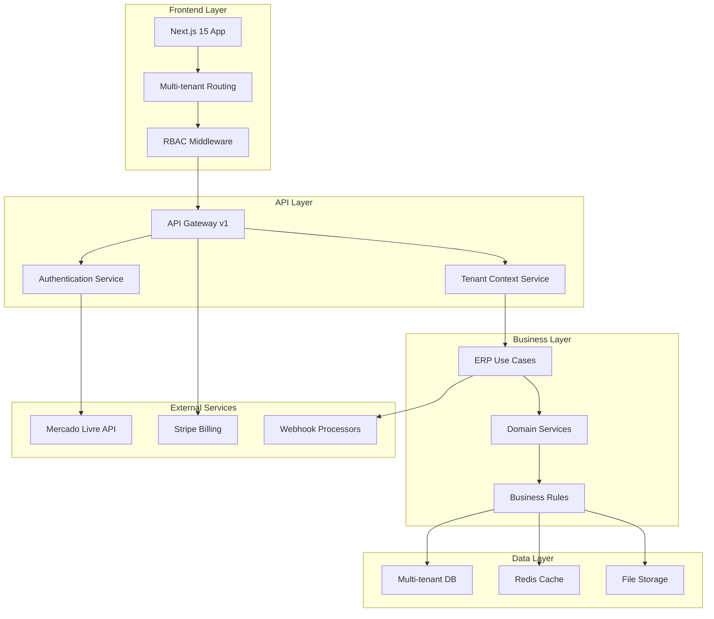

# Peepers Enterprise - Visão Geral Arquitetural

## 🎯 **Missão Enterprise**

Transformar o Peepers de plataforma de showcase em **SaaS ERP completo** para vendedores do Mercado Livre, com arquitetura multi-tenant, monetização via Stripe e conformidade enterprise.

---

## 📊 **Status Atual vs. Objetivo Enterprise**

### **Implementação Atual (v0.1.1)**
- ✅ **OAuth 2.0 + PKCE**: Conforme doc oficial ML
- ✅ **Clean Architecture**: Estrutura de camadas definida
- ✅ **Webhooks Básicos**: Topics principais implementados
- ⚠️ **Admin Panel**: Funcional mas sem multi-tenancy
- ❌ **Monetização**: Stripe não integrado
- ❌ **Multi-tenancy**: Hardcoded user authorization

### **Objetivo Enterprise (v2.0.0)**
- 🎯 **SaaS Multi-tenant**: Isolamento por tenant
- 🎯 **Monetização Stripe**: 3 planos (Starter/Pro/Enterprise)
- 🎯 **ERP Completo**: Orders, Inventory, Analytics, Messages
- 🎯 **Enterprise Security**: RBAC, Audit logs, Compliance
- 🎯 **Escalabilidade**: Database, Cache layers, Microservices

---

## 🏗️ **Arquitetura Enterprise Target**

---

## 🔍 **Gaps Críticos Identificados**

### **1. Conformidade com Mercado Livre API**

| Aspecto | Status | Ação Requerida |
|---------|--------|----------------|
| **Webhook Response Time** | ❌ | Implementar timeout 500ms obrigatório |
| **IP Whitelist** | ❌ | Validar IPs: 54.88.218.97, 18.215.140.160, etc. |
| **Webhook Signature** | ❌ | Implementar validação de assinatura ML |
| **Rate Limits User** | ❌ | 5.000 calls/dia por usuário |
| **Missed Feeds API** | ❌ | Implementar `/missed_feeds` recovery |

### **2. Multi-tenancy & Monetização**

| Componente | Status | Implementação |
|------------|--------|---------------|
| **Tenant Isolation** | ❌ | Schema per tenant ou Row-level security |
| **Stripe Integration** | ❌ | SDK + Webhooks + Billing portal |
| **Subscription Plans** | ❌ | Starter ($29), Pro ($99), Enterprise ($299) |
| **Entitlements System** | ❌ | Feature flags por plano |
| **Usage Tracking** | ❌ | API calls, storage, users por tenant |

### **3. Arquitetura & Segurança**

| Área | Gap | Solução |
|------|-----|---------|
| **Domain Layer** | Application/ vazia | Implementar Use Cases completos |
| **Error Handling** | Inconsistente | Unified error boundaries |
| **Testing** | 4% coverage | Unit (70%) + Integration (20%) + E2E (10%) |
| **Audit Logs** | Ausente | Estruturado + LGPD compliance |
| **Observability** | Básico | APM + Distributed tracing |

---

## 🚀 **Roadmap Enterprise (6 meses)**

### **Sprint 1-2: Fundação Multi-tenant (8 semanas)**
1. **Database Schema Multi-tenant**
2. **Stripe Integration Completa**
3. **Tenant Context Middleware**
4. **RBAC Implementation**

### **Sprint 3-4: ERP Core Features (8 semanas)**
1. **Orders Management Completo**
2. **Inventory Control**
3. **Advanced Analytics**
4. **Real-time Notifications**

### **Sprint 5-6: Enterprise Features (8 semanas)**
1. **Audit & Compliance**
2. **Advanced Security**
3. **API Rate Limiting Avançado**
4. **Microservices Architecture**

---

## 💰 **Modelo de Monetização**

### **Planos de Subscription**

| Plano | Preço | Limites | Features |
|-------|-------|---------|----------|
| **Starter** | R$ 149/mês | 5K API calls, 1 loja | Dashboard básico, sync produtos |
| **Pro** | R$ 499/mês | 50K API calls, 5 lojas | Analytics avançado, automações |
| **Enterprise** | R$ 1.499/mês | Ilimitado | White-label, API access, SLA |

### **Revenue Projections (12 meses)**
- **Year 1**: R$ 2.4M ARR (200 Starter + 50 Pro + 10 Enterprise)
- **Year 2**: R$ 7.2M ARR (500 Starter + 150 Pro + 30 Enterprise)
- **Year 3**: R$ 18M ARR (1000 Starter + 400 Pro + 100 Enterprise)

---

## 🔐 **Critérios "Pronto para Enterprise"**

### **Technical Requirements**
- [ ] **99.9% Uptime SLA**
- [ ] **Sub-200ms API response time**
- [ ] **Multi-region deployment**
- [ ] **Automated backup & disaster recovery**
- [ ] **Zero-downtime deployments**

### **Security & Compliance**
- [ ] **SOC 2 Type II** (ou equivalente)
- [ ] **LGPD Full Compliance**
- [ ] **PCI DSS** (para Stripe)
- [ ] **Penetration Testing** (trimestral)
- [ ] **Audit Logs** (7 anos retenção)

### **Business Operations**
- [ ] **24/7 Support** (Pro/Enterprise)
- [ ] **SLA Guarantees** (99.9% uptime)
- [ ] **Customer Success Team**
- [ ] **API Documentation** (OpenAPI 3.0)
- [ ] **Developer Portal**

---

## 📞 **Próximos Passos Imediatos**

### **Semana 1-2: Quick Wins**
1. ⚡ **Webhook timeout fix** (500ms compliance)
2. ⚡ **IP whitelist validation**
3. ⚡ **Rate limiting ML spec**
4. ⚡ **Missed feeds recovery**

### **Semana 3-4: Foundation**
1. 🏗️ **Multi-tenant database design**
2. 🏗️ **Stripe account setup + dev environment**
3. 🏗️ **RBAC middleware implementation**
4. 🏗️ **Error handling standardization**

### **Mês 2: MVP Multi-tenant**
1. 🚀 **Basic tenant isolation**
2. 🚀 **Stripe subscription flow**
3. 🚀 **Feature flags by plan**
4. 🚀 **Admin tenant management**

---

**🎯 Meta Q1 2025**: Peepers Enterprise MVP com 10 beta customers paying
**🎯 Meta Q2 2025**: 50 paying customers, break-even
**🎯 Meta Q3 2025**: 200 customers, Series A ready ($2M+ ARR)