# Implementation Flows - Mercado Livre Integration

## 🔄 **OAuth 2.0 + PKCE Flow (Implementation)**

### **Complete Authentication Sequence**

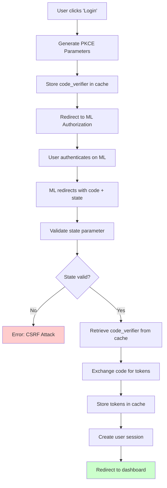

### **PKCE Implementation Details**

#### **Code Verifier Generation (RFC 7636)**
```typescript
function generateCodeVerifier(): string {
  // 43-128 characters, URL-safe
  const array = new Uint8Array(32);
  crypto.getRandomValues(array);
  return btoa(String.fromCharCode.apply(null, array))
    .replace(/\+/g, '-')
    .replace(/\//g, '_')
    .replace(/=/g, '');
}
```

#### **Code Challenge Generation**
```typescript
async function generateCodeChallenge(verifier: string): Promise<string> {
  const encoder = new TextEncoder();
  const data = encoder.encode(verifier);
  const digest = await crypto.subtle.digest('SHA-256', data);
  return btoa(String.fromCharCode.apply(null, new Uint8Array(digest)))
    .replace(/\+/g, '-')
    .replace(/\//g, '_')
    .replace(/=/g, '');
}
```

---

## 🎣 **Webhook Processing Flow**

### **Inbound Webhook Handler**

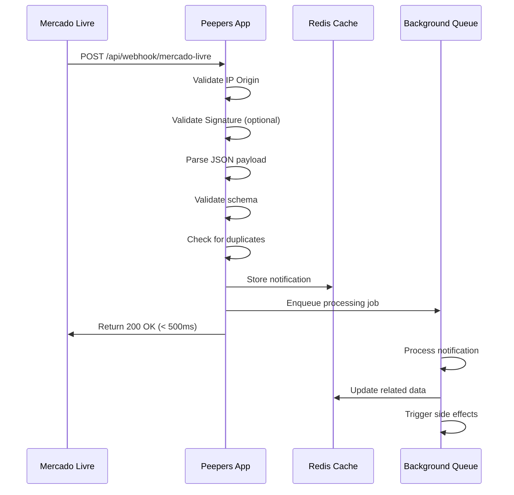

### **Topic-Based Processing**

#### **Orders Flow (orders_v2)**
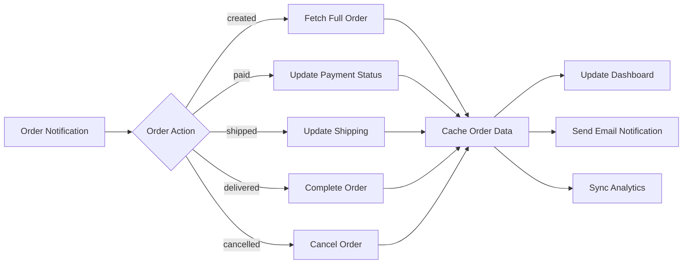

#### **Items Flow (items)**
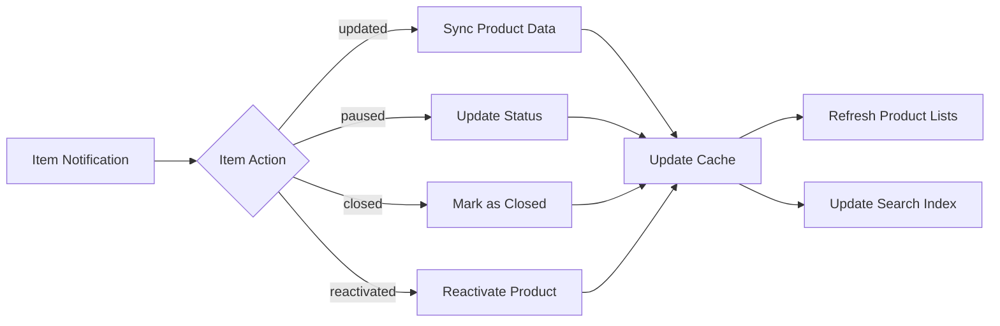

#### **Messages Flow (messages)**
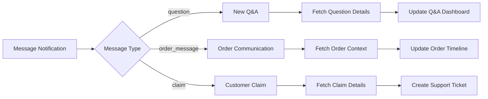

---

## 🚀 **Product Sync Flow**

### **Full Catalog Synchronization**

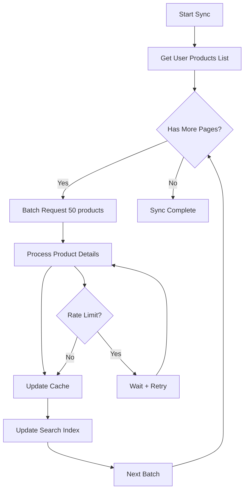

### **Incremental Updates (Webhook-Driven)**

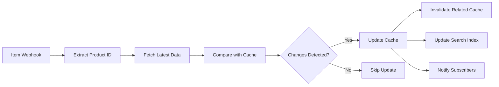

---

## 🎯 **Rate Limiting Strategy**

### **Multi-Level Rate Limiting**

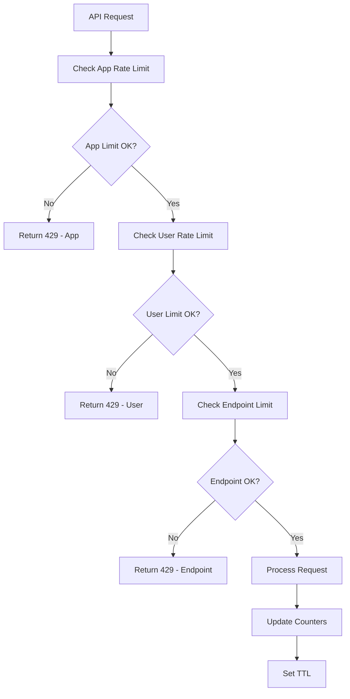

### **Exponential Backoff Implementation**

```typescript
class RateLimitHandler {
  private delays = [1000, 2000, 4000, 8000, 16000]; // ms
  
  async withRetry<T>(
    operation: () => Promise<T>,
    maxAttempts: number = 5
  ): Promise<T> {
    for (let attempt = 0; attempt < maxAttempts; attempt++) {
      try {
        return await operation();
      } catch (error) {
        if (error.status === 429 && attempt < maxAttempts - 1) {
          const delay = this.delays[attempt] || 16000;
          await this.sleep(delay);
          continue;
        }
        throw error;
      }
    }
    throw new Error('Max retry attempts exceeded');
  }
  
  private sleep(ms: number): Promise<void> {
    return new Promise(resolve => setTimeout(resolve, ms));
  }
}
```

---

## 🔍 **Error Handling Flows**

### **API Error Classification**

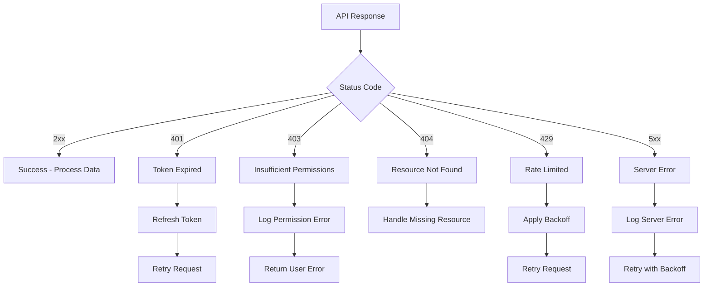

### **Token Refresh Flow**

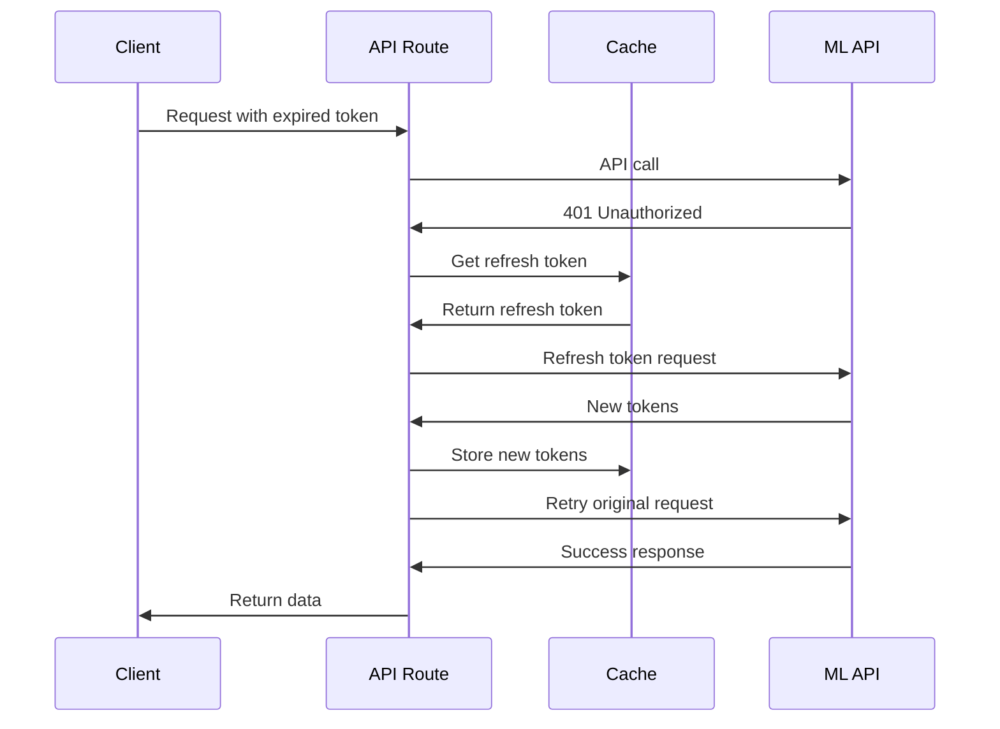

---

## 📊 **Data Synchronization Patterns**

### **Event-Driven Architecture**

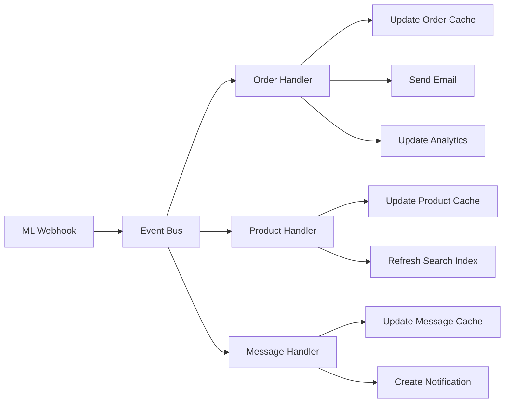

### **Cache Invalidation Strategy**

```typescript
class CacheInvalidator {
  async invalidateProduct(productId: string) {
    const patterns = [
      `product:${productId}`,
      `user:*:products`,
      `category:*:products`,
      `search:*`
    ];
    
    await Promise.all(
      patterns.map(pattern => this.redis.del(pattern))
    );
  }
  
  async invalidateUser(userId: string) {
    const patterns = [
      `user:${userId}:*`,
      `orders:${userId}:*`,
      `messages:${userId}:*`
    ];
    
    await Promise.all(
      patterns.map(pattern => this.redis.del(pattern))
    );
  }
}
```

---

## 🛡️ **Security Implementation**

### **Request Validation Pipeline**

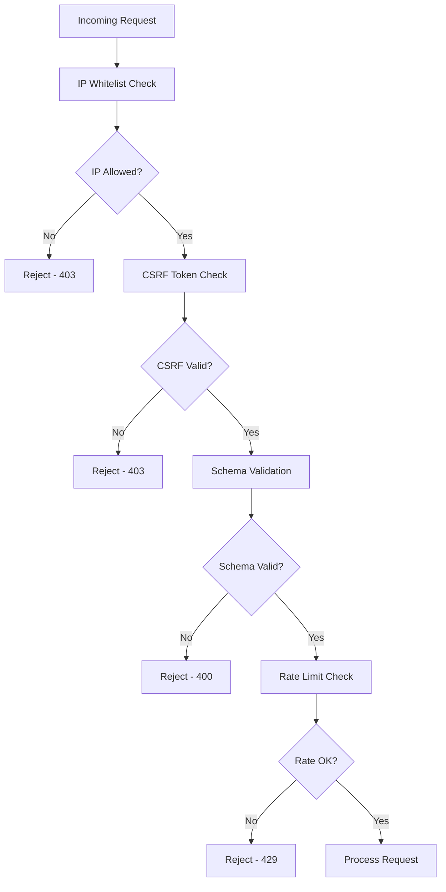

### **Webhook Signature Validation (Optional)**

```typescript
function validateWebhookSignature(
  payload: string,
  signature: string,
  secret: string
): boolean {
  const expectedSignature = crypto
    .createHmac('sha256', secret)
    .update(payload)
    .digest('hex');
  
  return crypto.timingSafeEqual(
    Buffer.from(signature, 'hex'),
    Buffer.from(expectedSignature, 'hex')
  );
}
```

---

## 📈 **Monitoring & Observability**

### **Metrics Collection Flow**

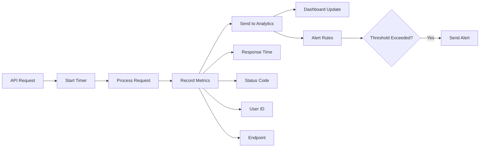

### **Error Tracking**

```typescript
class ErrorTracker {
  async trackError(error: Error, context: any) {
    const errorEvent = {
      message: error.message,
      stack: error.stack,
      context,
      timestamp: new Date().toISOString(),
      userId: context.userId,
      endpoint: context.endpoint,
      environment: process.env.NODE_ENV
    };
    
    // Log to structured logger
    logger.error('API Error', errorEvent);
    
    // Send to error tracking service
    await this.sendToSentry(errorEvent);
    
    // Update metrics
    await this.updateErrorMetrics(errorEvent);
  }
}
```

---

**🎯 PRÓXIMOS PASSOS**: Implementar os fluxos críticos identificados na auditoria, começando pelo timeout de webhook (500ms) e validação de IP whitelist.