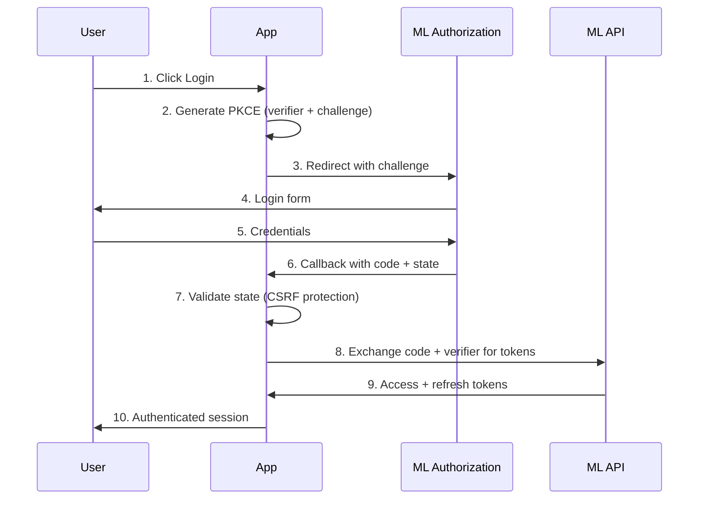

# Mercado Livre API - Documentação Oficial Consolidada

## 🔗 **Referências Oficiais**

- **Documentação Base**: [developers.mercadolivre.com.br](https://developers.mercadolivre.com.br)
- **OAuth & Auth**: [Autenticação e Autorização](https://developers.mercadolivre.com.br/pt_br/autenticacao-e-autorizacao)
- **Webhooks**: [Notificações](https://developers.mercadolivre.com.br/pt_br/produto-receba-notificacoes)
- **Produtos**: [Guia para Produtos](https://developers.mercadolivre.com.br/pt_br/guia-para-produtos)

---

## 🔐 **OAuth 2.0 + PKCE (CONFORME OFICIAL)**

### **Fluxo Completo Server-Side**



### **Parâmetros Obrigatórios (Spec Oficial)**

#### **1. Authorization Request**
```http
GET https://auth.mercadolivre.com.br/authorization
```

| Parâmetro | Obrigatório | Descrição |
|-----------|-------------|-----------|
| `response_type` | ✅ | Sempre `code` |
| `client_id` | ✅ | APP_ID do DevCenter |
| `redirect_uri` | ✅ | URL exata registrada |
| `state` | ✅ | CSRF protection (SecureRandom) |
| `code_challenge` | ✅ | SHA256(code_verifier) Base64URL |
| `code_challenge_method` | ✅ | Sempre `S256` |
| `scope` | ⚠️ | `offline_access read write` |

#### **2. Token Exchange**
```http
POST https://api.mercadolibre.com/oauth/token
```

| Parâmetro | Obrigatório | Descrição |
|-----------|-------------|-----------|
| `grant_type` | ✅ | `authorization_code` |
| `client_id` | ✅ | APP_ID |
| `client_secret` | ✅ | Secret Key |
| `code` | ✅ | Authorization code |
| `redirect_uri` | ✅ | Mesma URL do step 1 |
| `code_verifier` | ✅ | PKCE verifier original |

#### **3. Refresh Token**
```http
POST https://api.mercadolibre.com/oauth/token
```

| Parâmetro | Obrigatório | Descrição |
|-----------|-------------|-----------|
| `grant_type` | ✅ | `refresh_token` |
| `client_id` | ✅ | APP_ID |
| `client_secret` | ✅ | Secret Key |
| `refresh_token` | ✅ | Token de refresh atual |

### **Token Lifecycle (Spec Oficial)**

- **Access Token**: 6 horas de vida
- **Refresh Token**: 6 meses de vida, uso único
- **Rotation**: Cada refresh gera novo refresh_token
- **Invalidação**: Mudança de senha, revogação manual, 4 meses sem uso

---

## 📡 **Webhooks (CONFORMIDADE CRÍTICA)**

### **Requisitos Obrigatórios da Documentação Oficial**

| Requisito | Especificação ML | Status Peepers | Ação |
|-----------|------------------|----------------|------|
| **Response Time** | **≤ 500ms** | ❌ Não limitado | **CRÍTICO: Implementar timeout** |
| **HTTP Status** | **200 OK** | ✅ Implementado | ✅ |
| **Content-Type** | `application/json` | ✅ Implementado | ✅ |
| **IP Whitelist** | IPs específicos | ❌ Não validado | **CRÍTICO: Implementar** |
| **Retry Logic** | 1 hora tentativas | ⚠️ Parcial | **Melhorar logging** |

### **IPs Oficiais do Mercado Livre**
```javascript
const ML_WEBHOOK_IPS = [
  '54.88.218.97',
  '18.215.140.160', 
  '18.213.114.129',
  '18.206.34.84'
];
```

### **Topics Oficiais Suportados**

#### **Orders (Pedidos)**
- **`orders_v2`** ⭐ **RECOMENDADO**: Criação e alterações
- **`orders_feedback`**: Feedbacks de vendas

#### **Items (Produtos)**  
- **`items`**: Mudanças em produtos publicados
- **`questions`**: Perguntas e respostas
- **`items_prices`**: Alterações de preço
- **`stock-locations`**: Mudanças de estoque

#### **Messages (Mensagens)**
- **`messages`** com subtópicos:
  - `created`: Novas mensagens
  - `read`: Mensagens lidas

#### **Shipments (Envios)**
- **`shipments`**: Alterações em envios
- **`fbm_stock_operations`**: Operações FBM
- **`flex-handshakes`**: Transferências Flex

#### **Promotions (Promoções)**
- **`public_offers`**: Criação/alteração ofertas
- **`public_candidates`**: Candidatos a promoções

#### **Post Purchase**
- **`claims`**: Reclamações
- **`claims_actions`**: Ações em claims

### **Estrutura de Notificação Oficial**

#### **Formato Geral**
```json
{
  "_id": "notification_uuid",
  "resource": "/orders/2195160686",
  "user_id": 468424240,
  "topic": "orders_v2",
  "application_id": 5503910054141466,
  "attempts": 1,
  "sent": "2019-10-30T16:19:20.129Z",
  "received": "2019-10-30T16:19:20.106Z"
}
```

#### **Formato com Subtópicos**
```json
{
  "id": "uuid",
  "resource": "/vis/leads/93a14ee6-0356-4e20-b0c6-f4ad8f80bfff",
  "user_id": 123456789,
  "topic": "messages",
  "actions": ["created"],
  "application_id": 111111111,
  "attempts": 1,
  "sent": "2017-10-09T13:44:33.006Z",
  "received": "2017-10-09T13:44:32.984Z"
}
```

### **Missed Feeds API (Recovery)**
```http
GET https://api.mercadolibre.com/missed_feeds?app_id={APP_ID}
```

**Funcionalidades:**
- Notificações perdidas (não HTTP 200)
- Filtro por tópico: `&topic=orders_v2`
- Paginação: `&limit=50&offset=0`
- **Retenção**: Apenas 2 dias

---

## 🚦 **Rate Limits (Especificação Oficial)**

### **Limites Globais**

| Tipo | Limite | Escopo | Monitoramento |
|------|--------|--------|---------------|
| **Application** | **1.000 calls/hora** | Por app_id | Global |
| **User** | **5.000 calls/dia** | Por user_id | Por usuário |
| **Orders Search** | **100 calls/minuto** | Endpoint específico | `/orders/search` |

### **Headers de Rate Limit**
```http
X-RateLimit-Limit: 1000
X-RateLimit-Remaining: 847
X-RateLimit-Reset: 1640995200
```

### **Response Rate Limited (429)**
```json
{
  "error": "local_rate_limited",
  "message": "Too many requests",
  "cause": [],
  "status": 429
}
```

### **Estratégias de Rate Limiting**

#### **Exponential Backoff**
```javascript
const delays = [1000, 2000, 4000, 8000, 16000]; // ms
```

#### **Batch Operations**
- **Products**: Máximo 20 IDs por request
- **Paginação**: 50 padrão, 200 máximo
- **Scan Type**: Para +1000 produtos

---

## 🔍 **Endpoints Principais (Mapeamento Oficial)**

### **Authentication**
```http
POST /oauth/token
GET  /users/me
```

### **Products**
```http
GET  /items/{id}
GET  /users/{user_id}/items/search
POST /items
PUT  /items/{id}
```

### **Orders**
```http
GET  /orders/{id}
GET  /orders/search
POST /orders/{id}/feedback
```

### **Questions**
```http
GET  /questions/{id}
GET  /marketplace/questions/search
POST /questions/{id}/answer
```

### **Shipments**
```http
GET  /marketplace/shipments/{id}
GET  /marketplace/shipments/{id}/labels
POST /marketplace/shipments/{id}/tracking
```

### **Categories**
```http
GET  /sites/MLB/categories
GET  /categories/{category_id}
```

---

## ⚠️ **Compliance Gaps Identificados**

### **Críticos (Implementar Imediatamente)**

1. **Webhook Response Time**
   ```javascript
   // ATUAL: Sem limitação
   // REQUERIDO: ≤ 500ms
   const WEBHOOK_TIMEOUT = 500; // ms
   ```

2. **IP Whitelist Validation**
   ```javascript
   // ATUAL: Aceita qualquer IP
   // REQUERIDO: Validar IPs ML
   function validateMLOrigin(ip) {
     return ML_WEBHOOK_IPS.includes(ip);
   }
   ```

3. **User Rate Limiting**
   ```javascript
   // ATUAL: Apenas app-level
   // REQUERIDO: 5K calls/dia por user_id
   async function checkUserRateLimit(userId) {
     const key = `user_rate_limit:${userId}`;
     const calls = await redis.get(key) || 0;
     return calls < 5000;
   }
   ```

### **Importantes (Implementar em 30 dias)**

1. **Missed Feeds Recovery**
2. **Webhook Signature Validation**
3. **Enhanced Error Handling**
4. **Structured Logging**

### **Opcionais (Implementar em 90 dias)**

1. **Advanced Analytics**
2. **ML API Monitoring**
3. **Performance Optimization**
4. **Circuit Breakers**

---

## 📋 **Checklist de Conformidade**

### **OAuth 2.0 + PKCE**
- [x] Authorization flow com PKCE
- [x] State parameter validation
- [x] Token refresh rotation
- [ ] Error handling completo
- [ ] Security logging

### **Webhooks**
- [x] Basic POST handling
- [x] JSON validation
- [ ] **500ms timeout (CRÍTICO)**
- [ ] **IP whitelist (CRÍTICO)**
- [ ] Signature validation
- [ ] Missed feeds recovery

### **Rate Limiting**
- [x] Basic app-level limiting
- [ ] **User-level limiting (CRÍTICO)**
- [ ] Endpoint-specific limits
- [ ] Exponential backoff
- [ ] Circuit breakers

### **API Integration**
- [x] Basic CRUD operations
- [x] Pagination support
- [x] Error handling
- [ ] Batch operations optimization
- [ ] Advanced search filters
- [ ] Real-time sync

---

**🔴 AÇÃO IMEDIATA**: Os itens marcados como CRÍTICO devem ser implementados antes de qualquer release para produção para evitar bloqueio pela equipe do Mercado Livre.