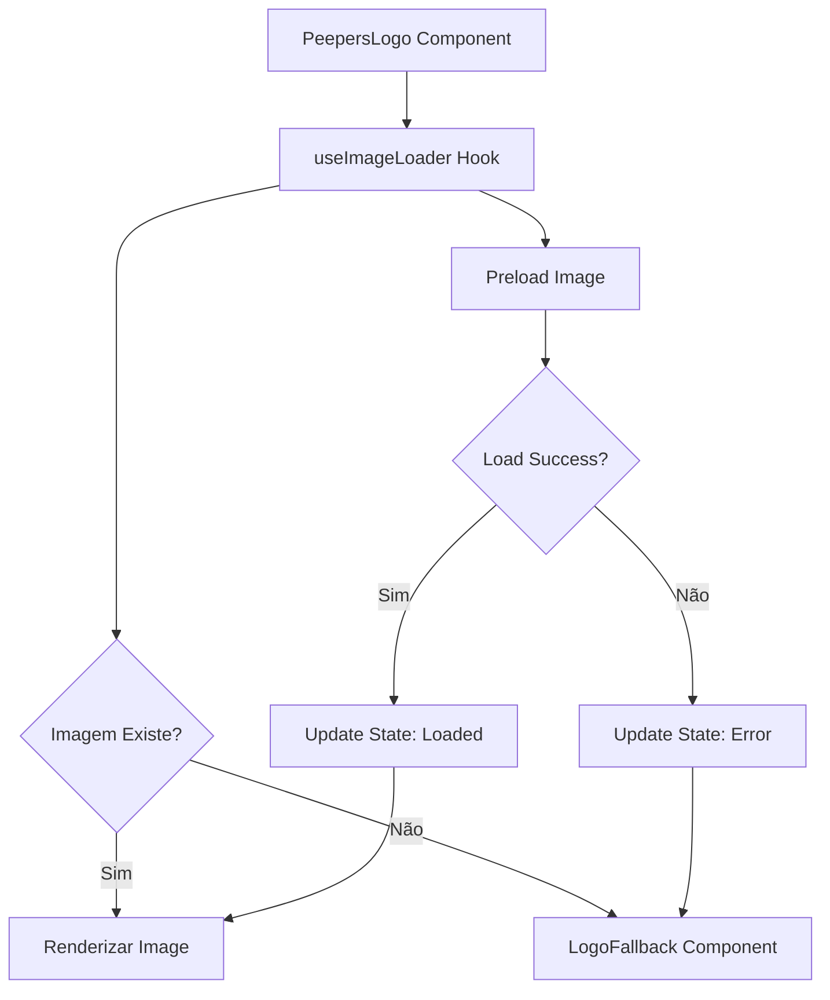

# Sistema de Logo Peepers - Documentação Técnica

## Visão Geral

Sistema robusto e escalável para gerenciamento de logos seguindo princípios SOLID e DRY. Implementa detecção inteligente de imagens, fallbacks automáticos e consistência visual em toda a aplicação.

## Arquitetura

### Componentes Principais

#### 1. `useImageLoader` Hook
**Localização:** `src/hooks/useImageLoader.ts`
**Responsabilidade:** Gerenciar estado de carregamento de imagens
**Princípios SOLID:**
- **Single Responsibility:** Apenas gerencia estado de imagens
- **Open/Closed:** Extensível sem modificação
- **Dependency Inversion:** Não depende de implementações concretas

```typescript
interface UseImageLoaderReturn {
  isLoaded: boolean;
  hasError: boolean;
  isLoading: boolean;
  handleLoad: () => void;
  handleError: () => void;
  reset: () => void;
}
```

#### 2. Configuração Centralizada
**Localização:** `src/config/logo.ts`
**Responsabilidade:** Single source of truth para configurações
**Princípio DRY:** Evita duplicação de configurações

```typescript
export const LOGO_CONFIG: LogoConfig = {
  sizes: {
    sm: { width: 120, height: 45 },
    md: { width: 160, height: 60 },
    lg: { width: 200, height: 75 },
    xl: { width: 280, height: 105 },
  },
  paths: {
    full: '/logo-full.png',
    icon: '/logo-icon.png',
  },
  fallback: {
    full: '👑 Peepers',
    icon: '👑P',
  },
  alt: {
    full: 'Peepers - Crowned Frog Logo',
    icon: 'Peepers Logo Icon',
  },
};
```

#### 3. Componente de Fallback
**Localização:** `src/components/LogoFallback.tsx`
**Responsabilidade:** Renderizar fallback consistente
**Características:**
- Responsivo baseado no tamanho
- Acessibilidade com ARIA labels
- Styling consistente

#### 4. Componente Principal
**Localização:** `src/components/PeepersLogo.tsx`
**Responsabilidade:** Componente principal de logo
**Características:**
- Detecção automática de imagens
- Fallback inteligente
- Otimização Next.js Image
- Acessibilidade completa

## Fluxo de Funcionamento



## Uso

### Básico
```tsx
import PeepersLogo from '@/components/PeepersLogo';

// Logo completo
<PeepersLogo variant="full" size="md" />

// Apenas ícone
<PeepersLogo variant="icon" size="sm" />
```

### Com Prioridade (Above the fold)
```tsx
<PeepersLogo variant="full" size="lg" priority />
```

### Com Classes Customizadas
```tsx
<PeepersLogo 
  variant="full" 
  size="md" 
  className="brightness-0 invert" 
/>
```

## Tamanhos Disponíveis

| Tamanho | Dimensões (Full) | Dimensões (Icon) | Uso Recomendado |
|---------|------------------|------------------|-----------------|
| `sm`    | 120x45px        | 45x45px         | Navegação mobile |
| `md`    | 160x60px        | 60x60px         | Header padrão |
| `lg`    | 200x75px        | 75x75px         | Hero sections |
| `xl`    | 280x105px       | 105x105px       | Landing pages |

## Fallbacks

### Estratégia de Fallback
1. **Preload Detection:** Hook detecta se imagem existe antes de renderizar
2. **Automatic Fallback:** Se imagem falha, mostra texto automaticamente
3. **Consistent Styling:** Fallback mantém proporções e styling
4. **Accessibility:** ARIA labels indicam que é fallback

### Textos de Fallback
- **Full Logo:** "👑 Peepers"
- **Icon Logo:** "👑P"

## Otimizações

### Performance
- **Preload Detection:** Evita flash de conteúdo
- **Next.js Image:** Otimização automática de imagens
- **Priority Loading:** Para logos above-the-fold
- **Lazy Loading:** Para logos abaixo da dobra

### Acessibilidade
- **Alt Text:** Descritivo e contextual
- **ARIA Labels:** Para fallbacks
- **Role Attributes:** Semântica correta
- **Focus Management:** Navegação por teclado

## Manutenção

### Adicionando Novos Tamanhos
1. Atualizar `LOGO_CONFIG.sizes` em `src/config/logo.ts`
2. Adicionar case no `LogoFallback` para font-size apropriado
3. Testar em diferentes resoluções

### Alterando Paths das Imagens
1. Atualizar `LOGO_CONFIG.paths` em `src/config/logo.ts`
2. Sistema automaticamente usa novos paths

### Customizando Fallbacks
1. Atualizar `LOGO_CONFIG.fallback` em `src/config/logo.ts`
2. Ajustar styling em `LogoFallback` se necessário

## Testes

### Cenários de Teste
1. **Imagem Existe:** Logo carrega corretamente
2. **Imagem Não Existe:** Fallback é mostrado
3. **Conexão Lenta:** Loading state funciona
4. **Diferentes Tamanhos:** Proporções corretas
5. **Acessibilidade:** Screen readers funcionam

### Comandos de Teste
```bash
# Testar componente isolado
npm run test -- LogoFallback.test.tsx

# Testar hook
npm run test -- useImageLoader.test.tsx

# Testar integração
npm run test -- PeepersLogo.test.tsx
```

## Troubleshooting

### Problemas Comuns

#### Logo Não Carrega
1. Verificar se arquivos existem em `/public/`
2. Verificar paths em `LOGO_CONFIG`
3. Verificar console para erros 404

#### Fallback Não Aparece
1. Verificar se `LogoFallback` está sendo importado
2. Verificar se `useImageLoader` está funcionando
3. Verificar estado no React DevTools

#### Tamanhos Incorretos
1. Verificar `LOGO_CONFIG.sizes`
2. Verificar CSS conflitante
3. Verificar aspect ratio das imagens

## Roadmap

### Próximas Melhorias
- [ ] Suporte a SVG
- [ ] Lazy loading inteligente
- [ ] Cache de detecção de imagens
- [ ] Suporte a dark mode automático
- [ ] Animações de transição
- [ ] Suporte a múltiplos formatos (WebP, AVIF)

## Changelog

### v1.0.0 (2025-01-09)
- ✅ Sistema inicial implementado
- ✅ Hook `useImageLoader` criado
- ✅ Configuração centralizada
- ✅ Componente de fallback
- ✅ Componente principal robusto
- ✅ Integração em todas as páginas
- ✅ Documentação completa
